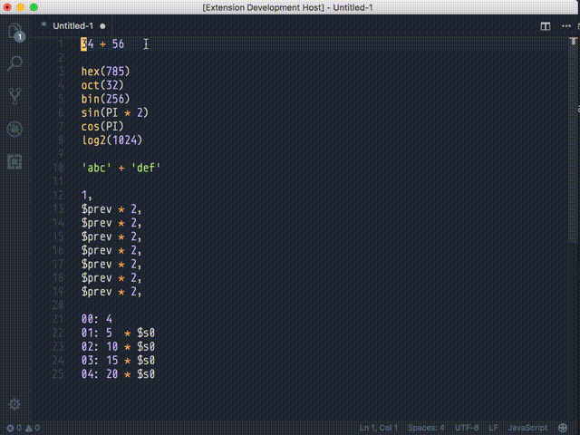

# vscode-eval README

Evaluate multiple selections as javascript expressions and replace them with their values.

## Features

* Evaluates javascript expressions.
* All functions and objects provided by the Math object are globals in eval.
* Extra Functions
    * `hex(number, padTo = 0, padChar = 0)` -- Convert number to hexadecimal.
    * `bin(number, padTo = 0, padChar = 0)` -- Convert number to binary.
    * `oct(number, padTo = 0, padChar = 0)` -- Convert number to octal.
    * `itoa(number, radix, padTo = 0, padChar = 0)` -- Convert a number from one radix to another.

## Extension Settings

This extension contributes the following settings:

* `eval.evalSelectionsByPosition`: If this is true, eval will evaluate expressions in order of their positions instead of the order they were created in. This is on by default.

## Release Notes

### 1.0.0

Initial release of Eval